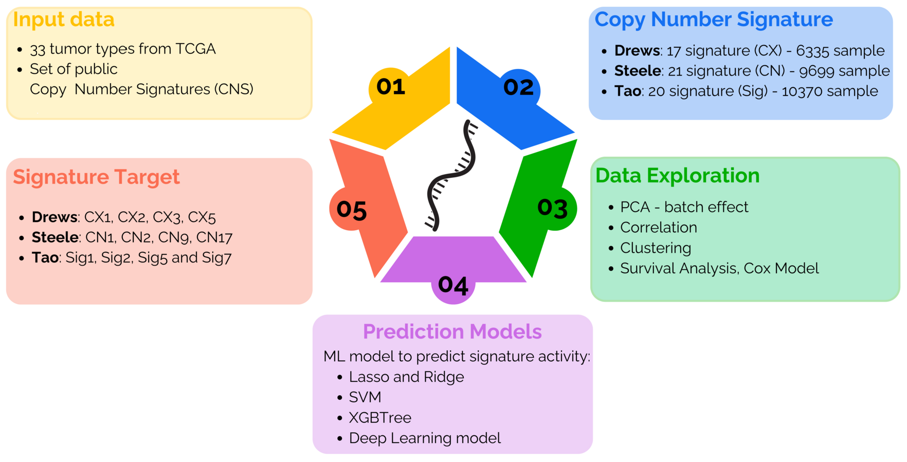

# CNS_ML

Analysis code and processed data for the manuscript **From Genomic Instability
to Prognosis: Copy Number Signature Clusters as Predictive Biomarkers Across
Tumors**.

The repository contains the analysis notebooks, processed inputs, and figure
outputs used in the paper. Raw TCGA data and source files from the three copy
number signature studies are not redistributed.



*Overview of the study workflow (Figure 1a of the manuscript).*

## Repository structure

```text
CNS_ML/
├── README.md
├── LICENSE
├── LICENSE-DATA.md
├── environment.yml
├── assets/
│   └── figure1_panel_a.png
├── data/
│   ├── README.md
│   └── processed/
│       ├── *.RData
│       └── zenodo/
├── code/
│   ├── 00_data_preprocessing.Rmd
│   ├── 01_signature_exploration.Rmd
│   ├── 02_clustering.Rmd
│   ├── 03_survival_analysis.Rmd
│   ├── 04_machine_learning.Rmd
│   └── 05_methylation_batch_effect.Rmd
└── Methylation_batch_ correction_result/
```

## Reproducing the analyses

Create the R/Python environment with:

```bash
conda env create -f environment.yml
conda activate cns_ml
```

The notebooks should be run in numerical order. Notebooks `01`, `02`, `03`,
and the Supplementary Figure 6 section of `05` can be run using the processed
files included in this repository. Notebook `00` documents the complete,
computationally intensive preprocessing workflow and uses external input paths.

Notebook `04` records the model specifications, hyperparameter grids, and
performance-extraction procedures used in the study. Serialized trained models
are not distributed because some were created with incompatible historical
package versions. They can be retrained from `final_matrices.RData` using the
documented stratified split and model code.

## Analysis notebooks

| Script | Manuscript content |
| --- | --- |
| `code/00_data_preprocessing.Rmd` | Multi-omics preprocessing and stratified train/test splitting |
| `code/01_signature_exploration.Rmd` | Signature distributions, PCA, Pearson correlations, Jaccard analyses |
| `code/02_clustering.Rmd` | Patient clustering and cluster composition |
| `code/03_survival_analysis.Rmd` | Kaplan-Meier curves, stratified Cox models, survival tables |
| `code/04_machine_learning.Rmd` | Continuous signature prediction and cluster prediction models |
| `code/05_methylation_batch_effect.Rmd` | Methylation platform harmonization, batch-effect checks, and Supplementary Figure 6 |

## Data

Small processed inputs required by the notebooks are stored in
`data/processed/`. The large starting matrices are distributed through the
associated [Zenodo record](https://doi.org/10.5281/zenodo.20617051):

- `final_matrices.RData` contains the final Drews, Steele, and Tao multi-omics
  matrices. These matrices allow users to recreate the train/test partitions
  and retrain any of the models described in `04_machine_learning.Rmd`.
- `exp_meth_post_normalization.RData` contains `ordinata`, the harmonized
  pan-cancer expression and methylation matrix used by the preprocessing
  workflow.

Place the downloaded files in `data/processed/zenodo/`. File contents and
dimensions are listed in
[`data/processed/zenodo/README.md`](data/processed/zenodo/README.md).

The folder `Methylation_batch_ correction_result/` contains the per-tumor
diagnostic plots used to identify the Infinium I/II probe-design bias and
assess BMIQ normalization.

## Outputs

The figures can be generated by running the corresponding `.Rmd` notebooks.
The final publication-quality figure files are provided with the manuscript
rather than duplicated in this repository.

## Citation

The processed datasets are available from Zenodo:
https://doi.org/10.5281/zenodo.20617051.

The manuscript citation will be added after publication.

## License

Code and analysis notebooks are licensed under the
[MIT License](LICENSE). Original documentation, figures, and processed data
produced for this project are licensed under
[CC BY 4.0](LICENSE-DATA.md).

Source data and third-party materials, including material derived from TCGA,
the NCI Genomic Data Commons, and the cited signature studies, remain subject
to their original access conditions, licenses, and citation requirements.
